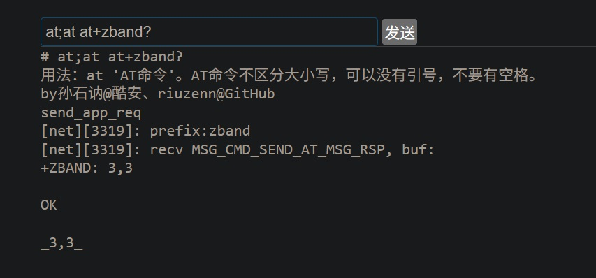
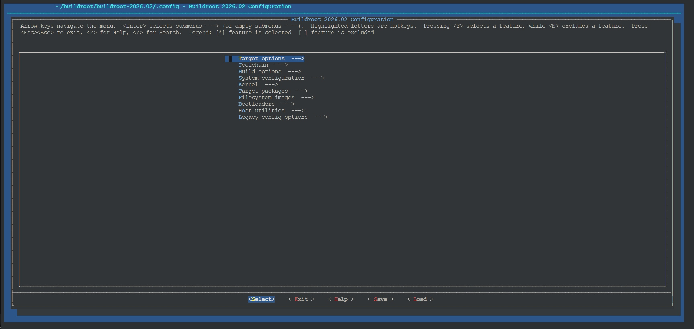
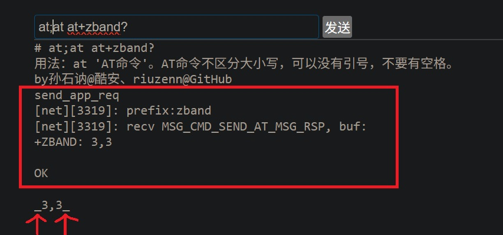
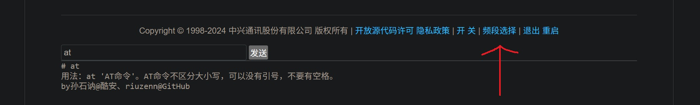
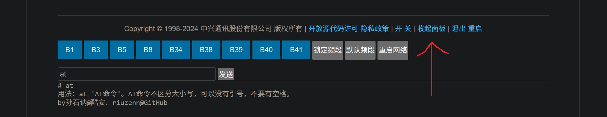
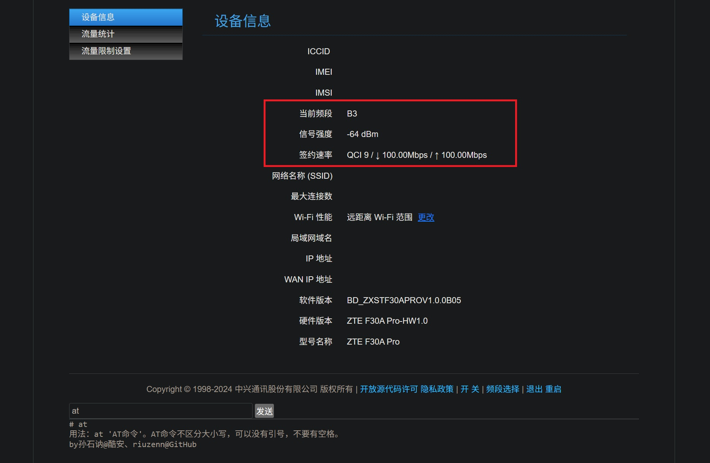
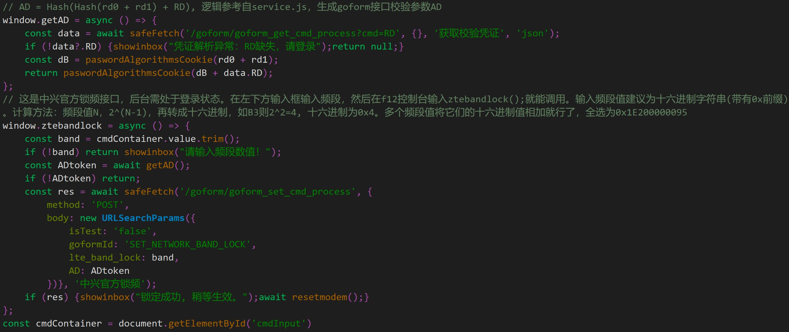
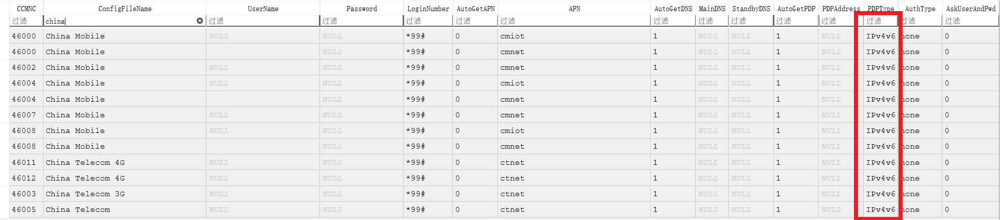
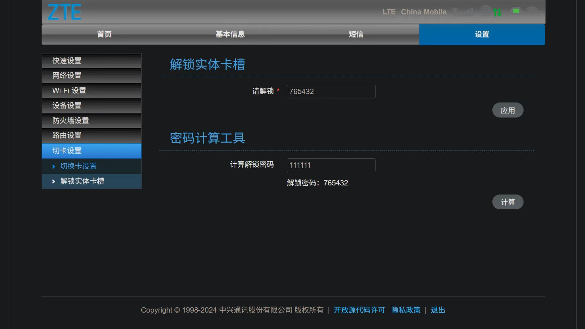

# zte-4g-portable-wifi-advanced-webui
中兴4G随身WiFi全功能后台 / A full-featured WebUI for ZTE 4G Mifi  
◉本工具目前只在f30a pro上测试过，其他设备请自行适配！！！shell、at、customfunc.js、bandlock.html这几个文件应该是通用的。  
## 利用原生CGI在web后台执行shell命令
### ➤下载:  
[shell](/etc_ro/cgi-bin/shell)  
[index.html](/etc_ro/web/index.html)  
[customfuncs.js](/etc_ro/web/js/customfuncs.js)  
[rc](/etc/rc)  
### ➤adb执行：  
adb shell mount -o remount,rw /  
adb shell mkdir -p /etc_ro/cgi-bin/  
adb push shell在你电脑上的位置 /etc_ro/cgi-bin/shell  
adb shell chmod 755 /etc_ro/cgi-bin/shell  
adb push index.html在你电脑上的位置 /etc_ro/web/index.html  
adb shell chmod 755 /etc_ro/web/index.html  
adb push customfuncs.js在你电脑上的位置 /etc_ro/web/js/customfuncs.js  
adb push rc在你电脑上的位置 /etc/rc  
下面这两个命令一定确保执行，不然重启设备不能初始化会软砖！！！  
这个命令给rc执行权限，adb push的文件默认权限没有执行  
adb shell chmod 755 /etc/rc  
确认结果为-rwxr-xr-x开头，不要是-rw-rw-rw-开头  
adb shell ls -l /etc/rc  
### ➤原理：  
◉反编译/bin/goahead可知f30a pro是支持cgi-bin的，硬编码了路径为/etc_ro/cgi-bin，只识别来自`http://192.168.0.1/cgi-bin/upload/`的命令请求。  
◉浏览器post了一个请求后，goahead将body的内容复制到/var/cgi*（*表示随机的一串字符），并将这个文件的路径赋值给$UPLOAD_FILENAME。我们要做的就是从$UPLOAD_FILENAME读取命令然后执行（eval）。  
◉/var路径挂载到硬盘不是内存，所以/var/cgi*重启还在，好在goahead会自动删除。少数情况如执行reboot后，goahead来不及删除，需要我们在/etc/rc开机脚本里添加rm -f /var/cgi*。  
### ➤已知bug:  
◉ls /var会比正常结果多一个cgi*，这是正常的，因为咱们靠cgi*文件工作，该文件在命令执行后就会删除。  
◉千万不要`cat /var/cgi*`，某个cgi*会发疯似的扩容到占满硬盘，具体原理不清楚。  
### ➤备注：  
◉受限于实现原理，每次fork出的shell进程执行过一次命令就会销毁，想一次执行多个命令建议用“;”分割,，比如说`ls /;ls /etc`  
◉我在/etc/rc里加了开机关闭led灯的命令和往防火墙里添加规则，不需要可以删除  
◉customfuncs.js封装了getAD();、evalcmd();等js函数。getAD();用于post某些goahead原生命令需要AD参数的情况；evalcmd();工作原理就是上面提到的，可以用于自定义链接，如<a href="javascript:void(0);" onclick="confirm('即将执行XX命令'); evalcmd('这里写shell命令如reboot');">我是重启</a>。  
◉index.html下面这一栏“开/关”是开/关adb，会重启；“退出”是退出登录；"重启"字面意思（值得一提的是goahead原生提供了REBOOT_DEVICE接口，但是需要处于登录状态，所以重启我调用的是evalcmd('reboot');。  
## 中兴随身wifi全功能后台的最后一块拼图--at工具
我编译了一个可执行文件，可以调用这个工具在命令行执行at命令。工具参考了官方zte_mifi和atweb的反编译代码，在这里向包括mWIFI_icu在内的前辈表示感谢。冲着这个工具可以给我一个star吗😍。  

  

### ➤编译:  
我先编译了适配中兴微ZX297520V3这颗cpu的Buildroot交叉编译器，adb pull随身wifi的/lib/路径下的依赖库到linux电脑里，最后用[Makefile](/Makefile)编译at工具，文件里的具体路径根据实际情况自行修改。值得一提的是，我在Makefile里加入了针对这颗cpu的大部分可用编译优化命令，可以尝试移植到其他二进制文件上。
#### 编译buildroot交叉编译器  
在这个网站下载Buildroot源码：https://buildroot.org/  
我选了最新Stable版的buildroot-2026.02  
当前路径是`~/buildroot`  
如果没有，创建并转到这个文件夹：`mkdir -p ~/buildroot;cd ~/buildroot`  
获取buildroot源码：`wget https://buildroot.org/downloads/buildroot-2026.02.tar.gz`  
解压：`tar -xzvf buildroot-2026.02.tar.gz;cd ./buildroot-2026.02`  
配置：`make menuconfig`  
界面如下，纯键盘操作  

  

➤Target options  
◉Target Architecture: ARM (little endian)  
◉Target Architecture Variant: cortex-A53  
◉Target ABI: EABI (没有hf后缀，随身wifi使用软件浮点，运行硬件浮点的二进制文件会导致重启)  
◉Floating point strategy: NEON/FP-ARMv8 (编译文件时可以添加-mfloat-abi=softfp -mfpu=neon-fp-armv8即硬件浮点计算，软件浮点传参)  
◉ARM instruction set: ARM (编译文件时可以添加-mthumb)  
➤Toolchain  
◉C library: uClibc-ng  
◉Kernel Headers→Manually specified Linux version→linux version：3.4.110 (内核版本是3.4.110-rt140)  
◉Kernel Headers→Manually specified Linux version→Custom kernel headers series： 3.4.x  
◉Kernel Headers→Custom tarball→URL of custom kernel tarball：https://cdn.kernel.org/pub/linux/kernel/v3.x/linux-3.4.110.tar.xz  
安装可能需要的工具包：`apt-get install -y rsync bc`  

普通用户不用管以下5行代码  
`sudo cp -r ~/buildroot /buildroot/`  
`sudo chown -R $(whoami):$(whoami) /buildroot`  
`cd /buildroot/buildroot-2026.02`  
`tmux attach`  
`export PATH=$PATH:~/buildroot/bin`
  
编译Buildroot交叉编译器：`make -j$(nproc) toolchain`  
编译时间近一小时，请耐心等待。看到`>>> toolchain  Installing to target`就成了  
打包、解压SDK和重定向的操作相当于给生成的编译器(位于./output/host)挪个地  
将编译器打包为SDK：`make sdk`  
解压SDK到~/buildroot：`tar -xvf ./output/images/arm-buildroot-linux-uclibcgnueabi_sdk-buildroot.tar.gz -C ~/buildroot --strip-components=1`  
重定向二进制文件路径：`cd ~/buildroot;./relocate-sdk.sh`  
查看生成的编译器硬编码参数：`./bin/arm-buildroot-linux-uclibcgnueabi-gcc -v`  
#### 编译at  
创建并转到文件夹：`mkdir -p ~/at_build;cd ~/at_build`  
写好Makefile里的绝对路径后上传Makefile、at.c和从随身wifi导出的/lib目录到当前目录  
编译：`make`  
编译失败清除中间文件：`make clean`
### ➤安装:  
[at](/sbin/at)  
adb shell mount -o remount,rw /  
adb push at文件在你电脑上的路径  /sbin/at  
adb shell chmod 755 /sbin/at  
### ➤原理：  
官方封装了一套和at串口通信的方法：zte_mifi把守大门，goahead接受前端url，向底层提交申请然后排队执行。我写的这个c程序就是调用官方的get_modem_info()函数，发送at命令，接收返回值。和已有的atwed的区别在于atweb开了个端口持续监听，需要后台运行，并且把大多数逻辑写进了编译后的文件，是一个小型的服务器。我这个工具只在命令行调用的时候运行，全功能后台主要靠js实现，性能可能没有编译后的c程序好。它就是个at端口信息的搬运工，和后台web的通信还是依赖默认的80端口，不需要后台。  
### ➤为什么要重复造轮子？  
用十六进制查看atweb就能发现它里面封装了收集包括imei、iccid等在内的信息然后和一串加密字符串拼接成url检测是否付费的函数，再加上atweb有很高权限，所以我才花时间把这个小东西写出来，并且附上源码[at.c](/at.c)，感兴趣可以自己编译。一切代码都是明文，我可以保证我提交的代码没有后台。不过值得注意的安全隐患是我没加校验，网络攻击者可以很轻易地执行shell命令，建议apn里不要启用ipv4v6。  
### ➤已知bug：  
输出包含过多底层日志，这是因为过程涉及复杂函数调用（编译的时候处理依赖库会很头疼），每个都会拉点屎。可以在源码里屏蔽了。我本着够用就行的原则没管。  

  

### ➤小设计：  
成功输出_at串口返回值_  
失败输出_ERROR_  
用正则表达式`/^_(我是要匹配的内容)_$/m`能轻松匹配。  
### ➤基于at工具实现的功能:  
◉首先需要下载推送以下文件，如有定制化需求自行适配。  
/etc_ro/cgi-bin/shell：通过post请求执行shell命令，一切的基础  
/etc/rc：一定确保push完后它有执行权限！！！开机脚本，可选。没有它运行久了/var路径可能会有垃圾  
/sbin/at：今天的主角，命令行执行at命令用  
/etc_ro/web/index.html：后台主界面，我在上面加了很多蓝色功能键  
/etc_ro/web/js/customfuncs.js：我写的大部分js函数都在里面  
/etc_ro/web/tmpl/bandlock.html：插入主界面的锁频面板  
/etc_ro/web/tmpl/status/device_info.html：设备信息页面添加当前频段和签约速率，我没有加定时刷新的代码，频段变化后要手动刷新页面  
◉锁频面板：at+zlteband=逗号分割的9组数字实现  

  

  

◉设备信息页面添加当前频段和签约速率：AT+CGEQOSRDP=1实现  

  

改串和锁小区等功能我用不到所以没在网页上加按钮。既然有了at工具可以自己在左下角的输入框执行AT命令，加at 前缀即可。  
◉查询及设置IMEI即串号  
AT+CGSN  
AT+MODIMEI=  
◉查看及锁小区  
AT+ZLC?  
AT+ZLC=  
格式：0(非锁定状态)或1(锁定状态),频点,小区  
◉查看及修改无线的mac地址  
AT+MAC?  
AT+MAC=  
### ➤官方锁频接口  
值得一提的是官方goahead留了锁频接口，但是没给网页前端入口。我把实现方法写入了customfuncs.js，感兴趣的可以试试。这个接口好在goahead已经编译相关代码，我们只需要写好前端js和按钮就好。坏处是要登录，调用过程繁琐。  

  

## 其他功能
◉自动APN设为IPv4v6,下载后push这个文件  
[auto_apn.db](/etc_ro/config/auto_apn/auto_apn.db)  
f30a pro的这个数据库文件默认为IP，我把数据库里国内运营商的APN都设为IPv4v6，想用IPv4使用手动APN。  

  

◉开机后关闭白色led灯
在[rc](/etc/rc) 里添加如下代码，sleep后面的数值是暂停的秒数  
(sleep 10;echo 0 > /sys/class/leds/modem_w_led/brightness) &  
◉更严格的防火墙规则  
在[rc](/etc/rc) 里添加如下代码  
/sbin/ipv4v6_firewall.sh &  
adb push[ipv4v6_firewall.sh](/sbin/ipv4v6_firewall.sh)文件到随身wifi的对应路径，chmod 755这个文件  
◉修改nv默认设置  
[default_parameter_sys](/etc_ro/default/default_parameter_sys)文件中  
cdrom_state=0和usb_devices_debug=diag,adb,serial（删掉mass_storage），adb开启状态不会加载CDROM设备（设备管理器和我的电脑不会显示cd设备）  
[default_parameter_user](/etc_ro/default/default_parameter_user)文件中  
need_support_sms=yes，f30a pro开启短信功能  
admin_Password=，设置默认密码，sha256加密  
privacy_read_flag=1，关闭重置后的隐私协议弹窗  
dm_update_mode=0，默认关闭自动检测新版本  
HideSSID=1，默认隐藏wifi名  
◉f30a pro自动计算切卡密码，下载后push这个文件  
[unclock_sim.html](/etc_ro/web/tmpl/adm/unclock_sim.html)  
中兴工程师取文件名时写错英语单词了，正确文件名应该拼写为unlock_sim.html。如果要为其他IMEI计算切卡密码也可以手动输入然后点计算。  

  

