# zte-4g-portable-wifi-advanced-webui
中兴4G随身WiFi全功能后台 / A full-featured WebUI for ZTE 4G Mifi  
◉本工具目前只在f30a pro上测试过，其他设备请自行适配！！！  
[123网盘备份](https://www.123pan.com/s/NV4Qjv-IZYvd)  
## 开启adb  
http://192.168.0.1/goform/goform_set_cmd_process?goformId=SET_DEVICE_MODE&debug_enable=1  
## 关闭adb  
http://192.168.0.1/goform/goform_set_cmd_process?goformId=SET_DEVICE_MODE&debug_enable=0  
## 关于adb的小知识
adb push支持中文字符和空格，用引号包裹整个路径即可  
直接从文件管理器拖动文件到cmd终端，自动填写路径  
## 避免adb push /etc/rc后忘加执行权限导致砖机的可能办法  
➤往/etc/inittab（644权限）的最开头加三行    
`::sysinit:mount -o remount,rw /dev/root /`  
`::sysinit:/bin/chmod 755 /etc/rc`  
`::sysinit:mount -o remount,ro /dev/root /`  
命令会在每次开机时重置权限。这个办法我试过可行（mount确认根目录是/dev/root这个设备路径，chmod 711 /etc/rc，reboot看权限有没有改成755），但是不推荐，万一这个文件里命令有错误就砖机了！！！  

我更推荐以下两个办法：  
➤往/etc/rc最后添加  
`mount -o remount,rw /`
`chmod +x /opt/mybin/mods.sh`  
`mount -o remount,ro /`  
`/opt/mybin/mods.sh &`  
以后自定义命令都在/opt/mybin/mods.sh里添加。  

➤使用修改过二进制数据的adbd，adb push后的文件默认0755权限：  
下载修改版的[adbd](https://github.com/riuzenn/zte-4g-portable-wifi-advanced-webui/blob/main/bin/adbd)  
```
#adb shell依赖要修改的adbd，改用ssh（需安装本页提供的dropbearmulti）  
ssh admin@192.168.0.1
mount -o remount,rw /
exit
scp adbd在你电脑上的位置 admin@192.168.0.1:/
ssh admin@192.168.0.1
#备份原版adbd
mv /bin/adbd /bin/adbd.bak
mv /adbd /bin
chmod 755 /bin/adbd
mount -o remount,ro /
exit
```
修改原理：  
```
文件偏移    原始字节（小端）     修改为  
0x479e      c0 f3 08 08        40 f2 ed 18  
原本是ubfx r8, r0, #0, #9，改为movw r8, #493 ; 0x1ed，强制寄存器r8 = 0x1ed（即 0755）。无论adb客户端传了啥权限值，都只用固定的0755  
0x483e      46 ea 08 08        00 bf 00 bf  
原本orr.w r8, r6, r8把owner的权限赋给group，r8会变成0775，改为nop,nop（无操作），防止r8被修改  
0x486c      32 46              42 46  
原本mov r2, r6改为mov r2, r8，直接使用固定的r8的值作为最终权限（这里r6是两次提权的结果，数值是0777）
```
## 自定义可执行文件和配置文件放哪  
我倾向于/opt/mybin和/opt/myconf，但是busybox貌似硬编码了PATH=/sbin:/usr/sbin:/bin:/usr/bin，又不想每次以全路径调用可执行文件。所以我决定接下来将可执行文件放/usr/sbin，因为4个路径里这里文件最少。sh脚本和配置文件放/opt/myconf。  
## 利用原生CGI在web后台执行shell命令
### ➤下载:  
[shell](/etc_ro/cgi-bin/shell)  
[index.html](/etc_ro/web/index.html)  
[customfuncs.js](/etc_ro/web/js/customfuncs.js)  
[rc](/etc/rc)  
### ➤adb执行：  
adb shell mount -o remount,rw /  
adb shell mkdir -p /etc_ro/cgi-bin/  
adb push shell在你电脑上的位置 /etc_ro/cgi-bin/shell  
adb shell chmod 755 /etc_ro/cgi-bin/shell  
adb push index.html在你电脑上的位置 /etc_ro/web/index.html  
adb shell chmod 755 /etc_ro/web/index.html  
adb push customfuncs.js在你电脑上的位置 /etc_ro/web/js/customfuncs.js  
adb push rc在你电脑上的位置 /etc/rc  
下面这两个命令一定确保执行，不然重启设备不能初始化会软砖！！！  
这个命令给rc执行权限，adb push的文件默认权限没有执行  
adb shell chmod 755 /etc/rc  
确认结果为-rwxr-xr-x开头，不要是-rw-rw-rw-开头  
adb shell ls -l /etc/rc
### ➤原理：  
◉反编译/bin/goahead可知f30a pro是支持cgi-bin的，硬编码了路径为/etc_ro/cgi-bin，只识别来自`http://192.168.0.1/cgi-bin/upload/`的命令请求。  
◉浏览器post了一个请求后，goahead将body的内容复制到`/var/cgi*（*表示随机的一串字符）`，并将这个文件的路径赋值给$UPLOAD_FILENAME。我们要做的就是从$UPLOAD_FILENAME读取命令然后执行（eval）。  
◉/var路径挂载到硬盘不是内存，所以`/var/cgi*`重启还在，好在goahead会自动删除。少数情况如执行reboot后，goahead来不及删除，需要我们在/etc/rc开机脚本里添加`rm -f /var/cgi*`。  
◉如图修改/bin/goahead的十六进制值将/var改为/tmp（tmp挂载到内存），就没有`/var/cgi*`文件残留的问题，因为重启后内存就会重置，/etc/rc里也不用加代码。我已经改好，下载推送设置权限即可[goahead](/bin/goahead)。  
<div align="center">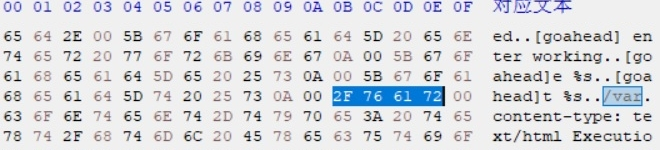</div>

### ➤已知bug:  
◉ls /var会比正常结果多一个`cgi*`，这是正常的，因为咱们靠`cgi*`文件工作，该文件在命令执行后就会删除。  
◉千万不要`cat /var/cgi*`，`cgi*`会发疯似的扩容到占满硬盘，具体原理不清楚。  
◉如果替换了我修改的goahead，千万不要`cat /tmp/cgi*`，内存应该会撑爆。  
### ➤备注：  
◉受限于实现原理，每次fork出的shell进程执行过一次命令就会销毁，想一次执行多个命令建议用“;”分割,，比如说`ls /;ls /etc`  
◉我在/etc/rc里加了开机关闭led灯的命令、往防火墙里添加规则、修改dns和修改内核参数实现减少内存占用的代码，不需要可以删除  
◉customfuncs.js封装了getAD();、evalcmd();等js函数。getAD();用于post某些goahead原生命令需要AD参数的情况；evalcmd();工作原理就是上面提到的，可以用于自定义链接，如`<a href="javascript:void(0);" onclick="confirm('即将执行XX命令'); evalcmd('这里写shell命令如reboot');">我是重启</a>`。  
◉index.html下面这一栏“开/关”是开/关adb，会重启；“退出”是退出登录；"重启"字面意思（值得一提的是goahead原生提供了REBOOT_DEVICE接口，但是需要处于登录状态，所以重启我调用的是evalcmd('reboot');。  
## 中兴随身wifi全功能后台的最后一块拼图--at工具
我编译了一个可执行文件，可以调用这个工具在命令行执行at命令。工具参考了官方zte_mifi和atweb的反编译代码，在这里向包括mWIFI_icu在内的前辈表示感谢。冲着这个工具可以给我一个star吗😍。  
<div align="center">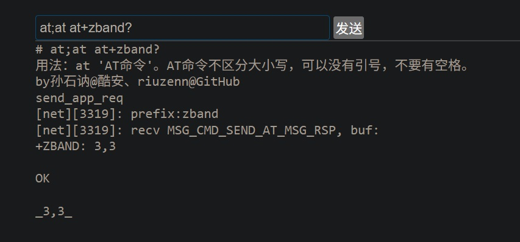</div>  

### ➤编译:  
我先编译了适配中兴微ZX297520V3这颗cpu的Buildroot交叉编译器，adb pull随身wifi的/lib/路径下的依赖库到linux电脑里，最后用[Makefile](/Makefile)编译at工具，文件里的具体路径根据实际情况自行修改。值得一提的是，我在Makefile里加入了针对这颗cpu的大部分可用编译优化命令，可以尝试移植到其他二进制文件上。
#### 编译buildroot交叉编译器  
在这个网站下载Buildroot源码：https://buildroot.org/  
我选了buildroot-2015.11.1因为它是最后一个支持uClibc-0.9.33.2（f30ap使用这个版本的c库）的版本。  
当前路径是`~/buildroot`  
如果没有，创建并转到这个文件夹：`mkdir -p ~/buildroot;cd ~/buildroot`  
获取buildroot源码：`wget https://buildroot.org/downloads/buildroot-2015.11.1.tar.gz`  
解压：`tar -xzvf buildroot-2015.11.1.tar.gz;cd ./buildroot-2015.11.1`  
可能需要：改extra/config/lxdialog/check-lxdialog.sh里的`main() {}`为`int main() { return 0; }`  
配置：`make menuconfig`  
界面如下，纯键盘操作  
<div align="left"></div>  

➤Target options  
◉Target Architecture: ARM (little endian)  
◉Target Architecture Variant: cortex-A7  
◉Target ABI: EABI (没有hf后缀，随身wifi使用软件浮点，运行硬件浮点的二进制文件会导致重启)  
◉Floating point strategy: Soft float (编译文件时可以添加-mfloat-abi=soft，中兴编译的内核没加入硬件浮点支持，不确定处理器本身是否支持)  
◉ARM instruction set: Thumb2  
➤Toolchain  
◉Kernel Headers：选择Manually specified Linux version(内核版本是3.4.110-rt140)  
◉linux version：输入3.4.110(内核版本是3.4.110-rt140)  
◉Custom kernel headers series：选择3.4.x  
◉C library: 选择uClibc  
◉uClibc C library Version：选择uClibc 0.9.33.x（我看过.config，2015.11.1默认用0.9.33.2版的）  
◉uClibc configuration file to use?：输入我配置好的package/uclibc/uClibc-0.9.33.2.config（下载[uClibc-0.9.33.2.config](https://github.com/riuzenn/zte-4g-portable-wifi-advanced-webui/blob/main/uClibc-0.9.33.2.config)推送到~/buildroot/buildroot-2015.11.1/package/uclibc）  
◉Enable RPC support：勾选（按y）  
◉Enable WCHAR support：勾选  
◉Enable stack protection support：勾选  
◉Enable compiler link-time-optimization support：勾选  
```
Enable compiler link-time-optimization support可以不勾选。若不勾选，makefile里的命令需要如下更改：
AR和RANLIB使用没gcc字样版的（若编译时出错）
export AR="${CROSS_COMPILE}ar"
export RANLIB="${CROSS_COMPILE}ranlib"
CFLAGS和LDFLAGS里去除-flto=auto（若有）
```

安装可能需要的工具包：`apt-get install -y rsync bc`  

普通用户不用管以下几行代码  
```
sudo cp -r ~/buildroot /buildroot
sudo chown -R $(whoami):$(whoami) /buildroot
cd /buildroot/buildroot-2015.11.1
cp /buildroot/buildroot-2015.11.1/output/images/arm-buildroot-linux-uclibcgnueabi_sdk-buildroot.tar.gz ~/buildroot
```

会去国外网站下源码，国内网络直连速度非常慢，记得...  
编译Buildroot交叉编译器：`make -j$(nproc) toolchain`  
wsl2用上了全部12线程，不算debug时间，编译时间10分钟，牛逼。之前用cloud shell要几个小时，过的是什么苦日子。  
看到`>>> toolchain virtual Installing to target`就成了  
<div></div>  

可能需要：  
buildroot-2015.11.1太老了，如果在新版本宿主机编译可能有SIGSTKSZ定义变化问题，可以考虑用docker  
```
sudo apt install -y docker.io
sudo usermod -aG docker $USER
newgrp docker
docker run --rm -it     -v /home/展开为用户名/buildroot:/home/展开为用户名/buildroot     ubuntu:18.04
cd /home/展开为用户名/buildroot/buildroot-2015.11.1
apt-get update
apt install -y build-essential python unzip rsync bc wget cpio file
exit
sudo chown -R $(whoami):$(whoami) ~/buildroot
```
~~下载这个修改过的[gen_wctype.c](https://github.com/riuzenn/zte-4g-portable-wifi-advanced-webui/blob/main/gen_wctype.c)，覆盖到/buildroot/buildroot-2015.11.1/output/build/uclibc-0.9.33.2/extra/locale  
echo 'CFLAGS += -march=armv7-a' >> /buildroot/buildroot-2015.11.1/output/build/uclibc-0.9.33.2/Rules.mak  
rm -rf output/build/host-gcc-final-4.9.3  
make host-gcc-final  
make host-gcc-final CXXFLAGS="-std=gnu++03"  
make host-gcc-final CXXFLAGS="-std=gnu++11"~~  

打包、解压的操作相当于给生成的编译器(位于./output/host/usr)挪个地  
打包编译器：`cd output/host/;tar -czf toolchain-backup.tar.gz usr/`  
解压到~：`tar -xvf toolchain-backup.tar.gz -C ~`  
查看生成的编译器硬编码参数：`cd ~;./usr/bin/arm-buildroot-linux-uclibcgnueabi-gcc -v`  
将编译器路径写入用户变量：  
`echo 'export PATH=$PATH:~/usr/bin' >> ~/.bashrc`  
`source ~/.bashrc`  
把f30ap/lib目录下的所有文件复制到编译电脑的~/usr/ztelib路径（建议通过adb pull或cp -rL等方式将软链接转换成实际文件，另外复制一份libuClibc-0.9.33.2.so重命名为libc.so，防止编译器用buildroot的sysroot路径下的c库，其他标准库同理）。  
#### 编译at  
创建并转到文件夹：`mkdir -p ~/at_build;cd ~/at_build`  
写好Makefile里的绝对路径后上传Makefile、at.c到当前目录  
编译：`make`  
编译失败重置：`make clean`
### ➤安装:  
[at](/sbin/at)  
adb shell mount -o remount,rw /  
adb push at文件在你电脑上的路径  /sbin/at  
adb shell chmod 755 /sbin/at  
### ➤原理：  
官方封装了一套和at串口通信的方法：zte_mifi把守大门，goahead接受前端url，向底层提交申请然后排队执行。我写的这个c程序就是调用官方的get_modem_info()函数，发送at命令，接收返回值。和已有的atwed的区别在于atweb开了个端口持续监听，需要后台运行，并且把大多数逻辑写进了编译后的文件，是一个小型的服务器。我这个工具只在命令行调用的时候运行，全功能后台主要靠js实现，性能可能比编译后的c程序好，因为js在访问后台的电脑和手机执行，c程序在性能孱弱的随身wifi运行，占用总共约32MB的运行内存的一部分。它就是个at端口信息的搬运工，和后台web的通信还是依赖默认的80端口，不需要后台。  
### ➤为什么要重复造轮子？  
用十六进制查看atweb就能发现它里面封装了收集包括imei、iccid等在内的信息然后和一串加密字符串拼接成url检测是否付费的函数，再加上atweb有很高权限，所以我才花时间把这个小东西写出来，并且附上源码[at.c](/at.c)，感兴趣可以自己编译。一切代码都是明文，我可以保证我提交的代码没有后台。不过值得注意的安全隐患是我没加校验，网络攻击者可以很轻易地执行shell命令，建议apn里不要启用ipv4v6。  
### ➤已知bug：  
输出包含过多底层日志，这是因为过程涉及复杂函数调用（编译的时候处理依赖库会很头疼），每个都会拉点屎。可以在源码里屏蔽了。我本着够用就行的原则没管。  
<div align="center">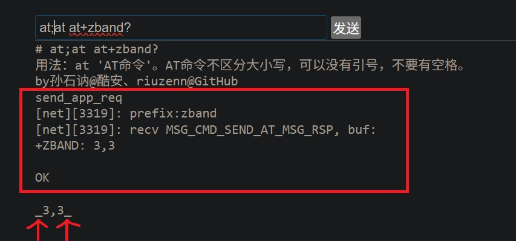</div>  

### ➤小设计：  
成功输出_at串口返回值_  
失败输出_ERROR_  
用正则表达式`/^_(我是要匹配的内容)_$/m`能轻松匹配。  
### ➤基于at工具实现的功能:  
◉首先需要下载推送以下文件，如有定制化需求自行适配。  
/etc_ro/cgi-bin/shell：通过post请求执行shell命令，一切的基础  
/etc/rc：一定确保push完后它有执行权限，不然设备开机不能初始化会变砖！！！开机脚本，可选。没有它运行久了/var路径可能会有垃圾（替换了goahead就没有这个问题）  
/bin/goahead：可选，解决了原来路径/var/cgi*文件残留的问题  
/sbin/at：今天的主角，命令行执行at命令用  
/etc_ro/web/index.html：后台主界面，我在上面加了很多蓝色功能键  
/etc_ro/web/js/customfuncs.js：我写的大部分js函数都在里面  
/etc_ro/web/tmpl/bandlock.html：插入主界面的锁频面板  
/etc_ro/web/tmpl/status/device_info.html：设备信息页面添加当前频段和签约速率，我没有加定时刷新的代码，频段变化后要手动刷新页面  
◉开 关这两个蓝色链接功能是开关adb，原理是在后台访问本文开头提到的两个链接  
◉锁频面板：at+zlteband=逗号分割的9组数字实现  
<div align="center">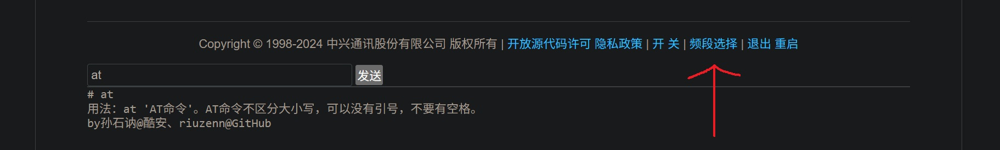</div>  
<div align="center">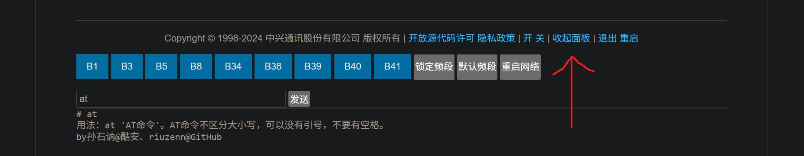</div>  

◉设备信息页面添加当前频段和签约速率：AT+ZBAND?和AT+CGEQOSRDP=1实现  
<div align="center">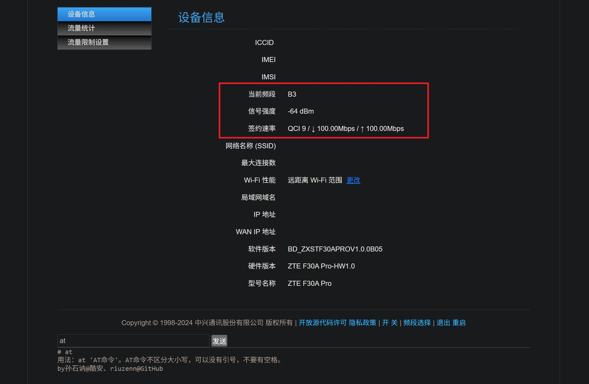</div>  

改串和锁小区等功能我用不到所以没在网页上加按钮。既然有了at工具可以自己在左下角的输入框执行AT命令，加at 前缀即可。  
◉查询及设置IMEI即串号  
AT+CGSN  
AT+MODIMEI=  
◉查看及锁小区  
AT+ZLC?  
AT+ZLC=  
格式：0(非锁定状态)或1(锁定状态),频点,小区  
◉查看及修改无线的mac地址  
AT+MAC?  
AT+MAC=  
### ➤官方锁频接口  
值得一提的是官方goahead留了锁频接口，但是没给网页前端入口。我把实现方法写入了customfuncs.js，感兴趣的可以试试。这个接口好在goahead已经编译相关代码，我们只需要写好前端js和按钮就好。坏处是要登录，调用过程繁琐。  
<div align="center">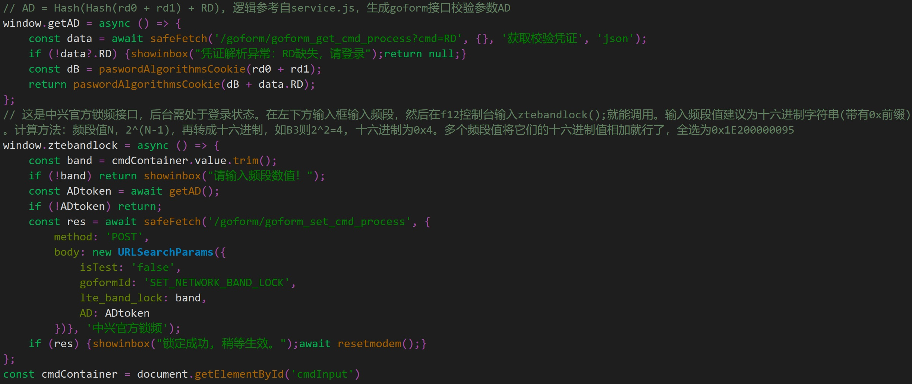</div>  

## 其他功能
### ◉自动APN设为IPv4v6,下载推送到/etc_ro/config/auto_apn/auto_apn.db  
[auto_apn.db](/etc_ro/config/auto_apn/auto_apn.db)  
f30a pro的这个数据库文件默认为IP，我把数据库里国内运营商的APN都设为IPv4v6，想用IPv4使用手动APN。  
<div align="center">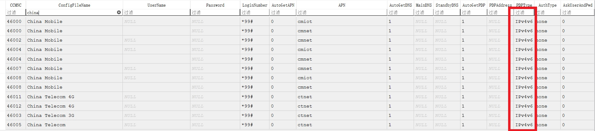</div>  

### ◉开机后关闭白色led灯（推送完rc记得chmod 755，不然重启后会砖）
在/etc/rc里添加如下代码，sleep后面的数值是暂停的秒数：  
(sleep 10;echo 0 > /sys/class/leds/modem_w_led/brightness) &  
### ◉更严格的防火墙规则  
在/etc/rc里添加如下代码：  
/sbin/ipv4v6_firewall.sh  
adb push[ipv4v6_firewall.sh](/sbin/ipv4v6_firewall.sh)文件到/sbin/ipv4v6_firewall.sh，chmod 755这个文件  
### ◉修改nv默认设置（推送完记得chmod 755，不然恢复出厂后会砖）  
[default_parameter_sys](/etc_ro/default/default_parameter_sys)文件中  
cdrom_state=0和usb_devices_debug=diag,adb,serial（删掉mass_storage），adb开启状态不会加载CDROM设备（设备管理器和我的电脑不会显示cd设备）  
[default_parameter_user](/etc_ro/default/default_parameter_user)文件中  
need_support_sms=yes，f30a pro开启短信功能  
admin_Password=，设置默认密码，sha256加密  
privacy_read_flag=1，关闭重置后的隐私协议弹窗  
dm_update_mode=0，默认关闭自动检测新版本  
HideSSID=1，默认隐藏wifi名  
wifi_11n_cap=0，wifi默认频宽设为20MHz  
### ◉f30a pro自动计算切卡密码，下载推送到/etc_ro/web/tmpl/adm/unclock_sim.html  
[unclock_sim.html](/etc_ro/web/tmpl/adm/unclock_sim.html)  
中兴工程师取文件名时写错英语单词了，正确文件名应该拼写为unlock_sim.html。如果要为其他IMEI计算切卡密码也可以手动输入然后点计算。  
<div align="center">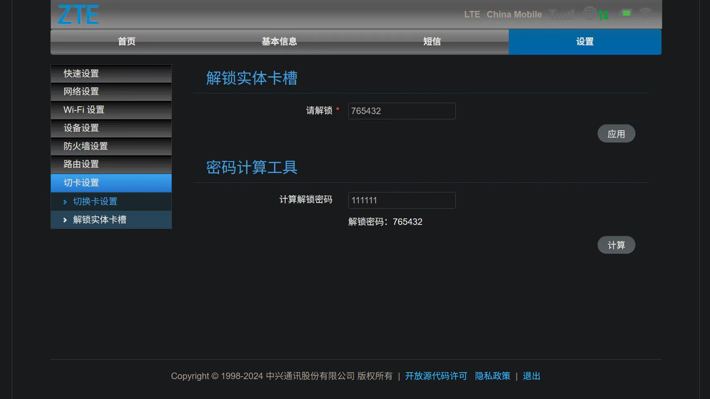</div>  

### ◉测试内核是否支持硬件浮点  
下载[fpu_test.c](./fpu_test.c)，按如下命令编译  
```
$HOME/usr/bin/arm-buildroot-linux-uclibcgnueabi-gcc \
    -Os \
    -march=armv7-a -mtune=cortex-a53 \
    -mfloat-abi=softfp \
    -mfpu=vfp \
    fpu_test.c \
    -o fpu_vfp
```
发现一执行到VFP指令集就退出，报错Illegal instruction，换成-mfloat-abi=soft能正常输出结果，说明内核不支持硬件浮点，但是库文件里可以搜到硬件浮点指令，这一点很割裂。  
### ◉修改连接到随身wifi设备的默认dns  
(adb shell)nv set dhcpDns="223.5.5.5 223.6.6.6"  
(adb shell)nv set DNS_proxy=disable  
nv save  
### ◉修改linux系统dns为阿里dns  
下载[resolv.conf](/etc_ro/resolv.conf)推送/etc_ro/resolv.conf  
在rc里添加  
mount --bind /etc_ro/resolv.conf /etc/resolv.conf  
killall dnsmasq  
### ◉内核优化参数  
下载[sysctl.conf](/etc/sysctl.conf)  ，推送到/etc/sysctl.conf  
rc中添加  
sysctl -qp /etc/sysctl.conf  
主要是内核级地禁用了ipv6，并激进地杀掉结束的或长时间不响应的链接来减少内存占用。  
### ◉修改后台网页标题、修改后台网页图标为蓝字ZTE、透明底的网页标签图标  
修改/etc_ro/web/js/config/ufi/mf93d/config.js里的WEBUI_TITLE:"4G Mobile Hotspot"，修改引号里的内容为自定义字符串。  
下载[favicon.ico](/etc_ro/web/favicon.ico)，推送到/etc_ro/web/favicon.ico。  
<div align="center"></div>  

### ◉显示所有接入设备的名称和物理地址  
下载[home.html](/etc_ro/web/tmpl/home.html)，推送到/etc_ro/web/tmpl/home.html  
点查看就能看到。  
ip neigh show结果中REACHABLE是处于连接状态的设备。  
dumpleases -f /etc_rw/udhcpd.leases包括所有连接过的设备，但是当前不一定在线。  
两个结合一下就能得出当前在线的所有设备。但是目前我不知道如何很好地区分wifi和rndis设备。  
另外js提取一下字符串，再加一个官方风格的`<table>`标签，会和谐一点，但是我懒，凑活看吧。  
<div align="center">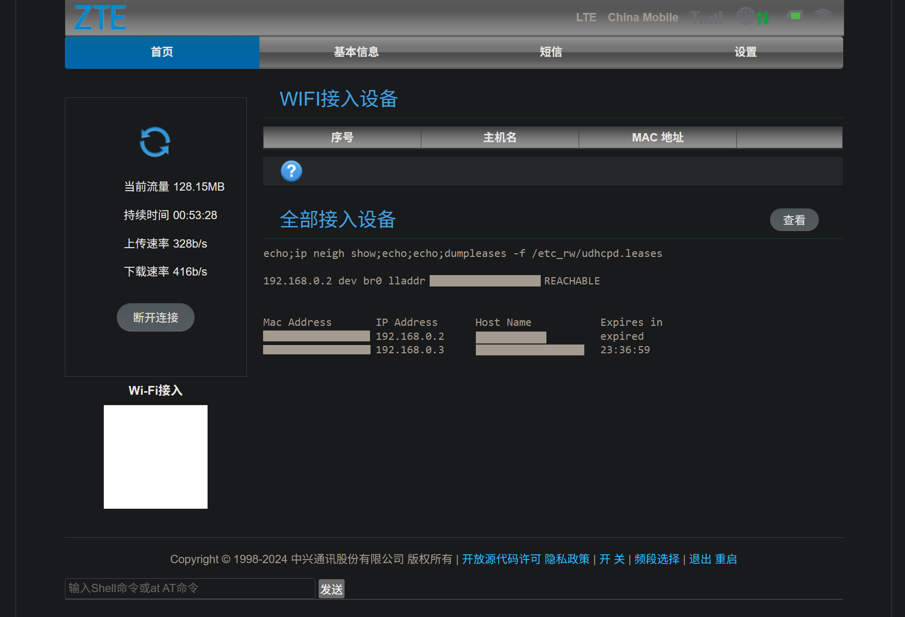</div>  

### ◉快速开机不适用中兴随身wifi棒子  
往/etc_ro/web/js/config/ufi/mf93d/menu.js添加以下代码，在设置-设备设置里会多出快速开机，真的会快一点吗？我没感觉出来。  
```
,{
  hash: "#fastboot",
  path: "adm/fastboot",
  level: "3",
  parent: "#device_setting",
  requireLogin: a,
  checkSIMStatus: false
}
```
从通电到设备变白灯这段时间不会因为快速开机开关改变，都是20s左右。我看了一下service.js文件负责传递网页上用户选是还是否（mgmt_quicken_power_on，/etc_ro/default/default_parameter_user有这个flag，默认为0），传给goahead，后者写入nv。zte_mifi读取nv设置值，执行相应逻辑。zte_mifi里面藏着相关逻辑。开启了mgmt_quicken_power_on，设备并不会真正关机，而是进入低功耗模式，我觉得类似电脑睡眠，设备并没有真正关机断电。按下电源键开机后只是把设备唤醒，自然快咯。棒子没有电源键也没电池，所以这个功能对于棒子来说没用，所以隐藏了。  
<div align="center">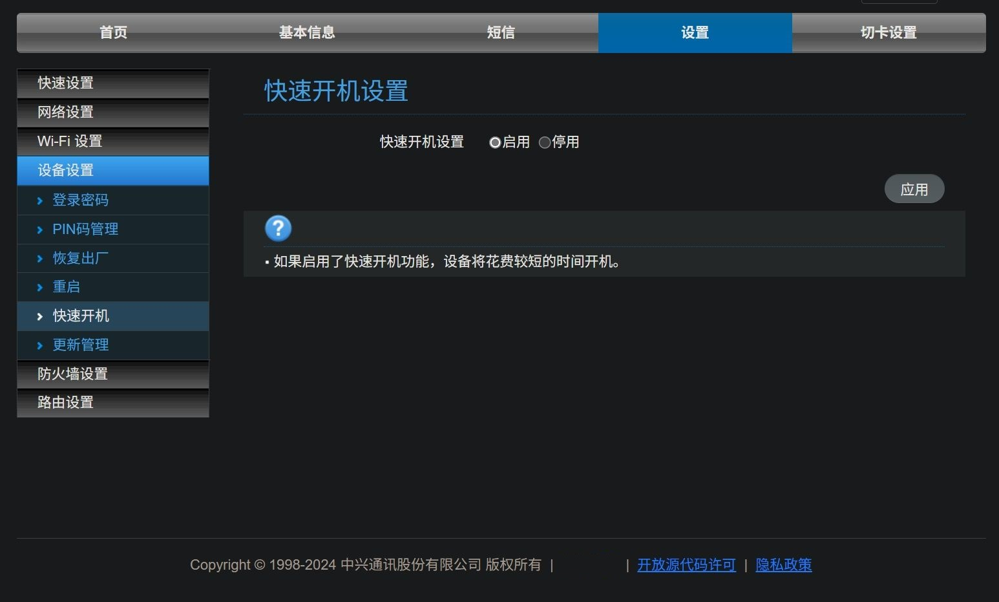</div>  

### ◉登录机制  
http://192.168.0.1/goform/goform_get_cmd_process?isTest=false&cmd=LD  
得到json格式的LD登录凭证  
{"LD":"427C02FDC13A7F4842703C2081DC56070572422BD398AD411B6A00C34EAE5267"}  
最终密码=sha256加密((sha256加密明文密码，结果转大写字母)拼接LD字符串)，结果转大写字母  
http://192.168.0.1/goform/goform_set_cmd_process?isTest=false&goformId=LOGIN&password=最终密码  
备注：  
LD不是常量，反编译goahead发现LD是其根据时间型号等信息生成的sha256值，且会为每个未登录的 IP 分配一个临时的 LD，如果前一个 LD 还没有被“消耗”（即还没有进行过一次失败或成功的 LOGIN POST），后端程序为了节省计算资源，会返回同一个LD值。  
原版逻辑里第二个链接是通过post方式提交，实测直接访问链接或者说get方式也行。  
## 编译的其他应用  
除了at外，我还编译了以下应用。所有应用的二进制文件都用[sstrip](https://github.com/BR903/ELFkickers)处理过，缩小了体积。  
编译sstrip：  
```
cd ~
git clone https://github.com/BR903/ELFkickers.git
cd ELFkickers/sstrip
make > ~/1.txt 2>&1
# 超级精简一个二进制可执行文件
~/ELFkickers/sstrip/sstrip 目标文件
```
为了缩小体积，我编译的应用都没启用生成位置无关可执行文件（#gcc4.9不支持-no-pie参数）、完整重定位只读、栈溢出保护。dropbear可能暴露在公网，可如下添加参数开启保护，开启与否有约10KB的大小差别：  
export CFLAGS="-fPIE -fstack-protector-strong"  
export LDFLAGS="-pie -Wl,-z,relro -Wl,-z,now ./stack_chk_fix.o"  
cat > stack_chk_fix.c << 'EOF'  
/* 弱符号定义，c库不提供这个符号，满足链接器的符号检查，运行时由动态链接器提供真实值 */  
void *__stack_chk_guard __attribute__((weak, visibility("hidden")));  
EOF  
${CROSS_COMPILE}gcc -c stack_chk_fix.c -o stack_chk_fix.o ${CFLAGS}  

### ◉dropbear及其附带的scp、dropbearkey  
#### 编译命令已写入[Makefile-dropbear](https://github.com/riuzenn/zte-4g-portable-wifi-advanced-webui/blob/main/Makefile-dropbear)。以下是几个注意点：  
➤如需使用密码登录ssh，dropbear会用到/lib/libcrypt.so.0库的crypt()函数，[testcrypt.c](https://github.com/riuzenn/zte-4g-portable-wifi-advanced-webui/blob/main/testcrypt.c)检测结果显示自带的libcrypt库只支持DES和MD5算法，如调用不支持的算法会回退到DES算法，取原盐值的前两位如$6作为新盐值。最后得出和/etc/shadow(默认SHA512算法)里记录的不一样的密码哈希值，从而一直验证失败。  
<div align="center">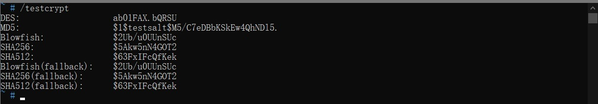</div>  

解决方式有把全功能的libcrypt静态编译进dropbear，  
要么改随身wifi的/etc/shadow里的密码算法为MD5，格式：  
`账户名:$1$盐值$MD5值:17751:0:99999:7:::`  
要么改随身wifi的/etc/passwd里的密码为空，配合dropbear的`-B Allow blank password logins`参数空密码登录。格式：  
`账户名:x(去掉这个x):0:0:root:/:/bin/sh`  
要么禁用密码登录`-s Disable password logins`，改用密钥登录。  
➤还是libcrypt库的问题，`export LIBS="-Wl,--no-as-needed ${ZTE_LIB}/libcrypt.so.0"`不能少，不然编译出的文件的依赖库里没有它，不能验证密码。  
➤如需压缩功能，编译dropbear可能会用到[libz.so.1.2.11库](https://zlib.net/fossils/zlib-1.2.11.tar.gz)的两个头文件，解压出zconf.h和zlib.h放到buildroot/arm-buildroot-linux-uclibcgnueabi/sysroot/usr/include/，不知道为啥buildroot不自带。  
➤第一次连接ssh会提示服务主机的公钥指纹不在已知列表，输入yes。之后输入账户明文密码按回车，输入的密码不会同步显示到屏幕，也不会有光标闪烁，第一次接触这个机制时我还以为程序卡住了。  
#### 参考安装过程：
编译好的[dropbearmulti](https://github.com/riuzenn/zte-4g-portable-wifi-advanced-webui/blob/main/usr/sbin/dropbearmulti)连同[sshon](https://github.com/riuzenn/zte-4g-portable-wifi-advanced-webui/blob/main/usr/sbin/sshon)和[sshoff](https://github.com/riuzenn/zte-4g-portable-wifi-advanced-webui/blob/main/usr/sbin/sshoff)推送到/usr/sbin，更新过的[index.html](https://github.com/riuzenn/zte-4g-portable-wifi-advanced-webui/blob/main/etc_ro/web/index.html)和[customfuncs.js](https://github.com/riuzenn/zte-4g-portable-wifi-advanced-webui/blob/main/etc_ro/web/js/customfuncs.js)推送到/etc_ro/web和/etc_ro/web/js，执行：  
```  
mount -o remount,rw /
chmod 755 /usr/sbin/dropbearmulti
chmod 755 /usr/sbin/sshon
chmod 755 /usr/sbin/sshoff
ln -s /usr/sbin/dropbearmulti /usr/sbin/scp
ln -s /usr/sbin/dropbearmulti /usr/sbin/dropbear
ln -s /usr/sbin/dropbearmulti /usr/sbin/dropbearkey
# 生成dropbear服务器端密钥
mkdir -p /etc/dropbear
dropbearkey -t ed25519 -f /etc/dropbear/dropbear_ed25519_host_key
# 查看生成的dropbear服务器公钥
dropbearkey -y -f /etc/dropbear/dropbear_ed25519_host_key
```
#### 如需密钥登录，执行：  
windows电脑cmd里执行：  
```
# 生成windows用户端密钥，不设密码的话一直回车
ssh-keygen -t ed25519
```
随身wifi的终端里执行：  
```
# 把windows用户端公钥放进dropbear可以识别的目录~/.ssh
# f30ap的HOME路径就是根目录
mkdir -p ~/.ssh
chmod 700 ~/.ssh
# 在windows电脑C:\Users\你的用户名\.ssh路径找到公钥文件id_ed25519.pub，用文本编辑器打开，换行符换成LF，另存为authorized_keys，推送到/.ssh
chmod 600 ~/.ssh/authorized_keys
# 之后直接通过密钥认证，不需要输入账户密码
```
#### 启动和连接dropbear的ssh的命令  
我写了sshon和sshoff，直接输入它们的文件名就可以开启和关闭。windows的cmd里输入ssh admin@192.168.0.1即可连接。  
f30ap的默认账户名是admin，如需修改要同步改/etc里的passwd和shadow。另外以管理员身份打开文本编辑器，在`C:\Windows\System32\drivers\etc\hosts`里加入`192.168.0.1 自定义字符`就可以以域名连接，如`ssh admin@f30`。  
<div align="center">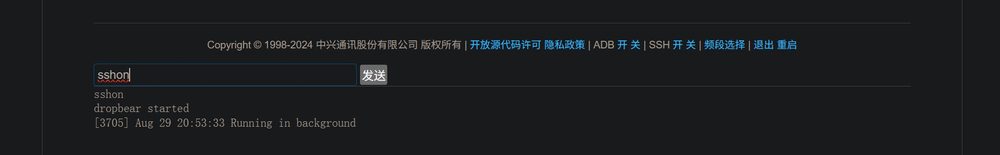</div>  

#### scp用法  
scp和下面的sftp-server都依赖dropbear提供的ssh环境，使用前二者前要先启用dropbear。  
<div align="center">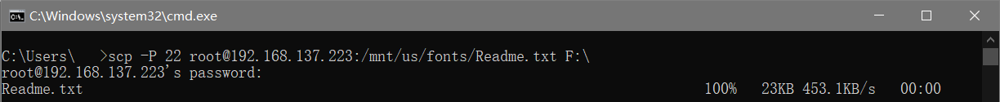</div>  

### ◉sftp-server  
#### 编译命令已写入[Makefile-sftp-server](https://github.com/riuzenn/zte-4g-portable-wifi-advanced-webui/blob/main/Makefile-sftp-server)。编译好的[sftp-server](https://github.com/riuzenn/zte-4g-portable-wifi-advanced-webui/blob/main/usr/libexec/sftp-server)推送到/usr/libexec路径，chmod 755。  
<div align="center">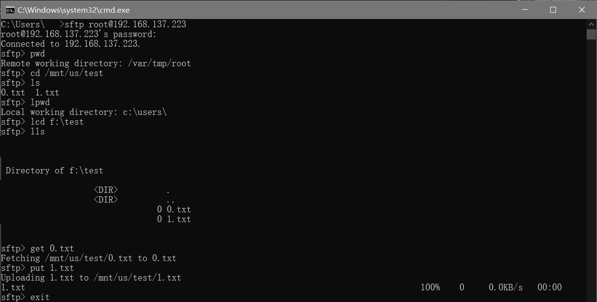</div>  

### ◉neatvi  
#### 编译命令已写入[Makefile-neatvi](https://github.com/riuzenn/zte-4g-portable-wifi-advanced-webui/blob/main/Makefile-neatvi)。编译好的[vi](https://github.com/riuzenn/zte-4g-portable-wifi-advanced-webui/blob/main/bin/vi)推送到/bin路径，chmod 755。有几个注意点：  
➤如下改源码里的term.c里的term_read()函数，不然不识别windows的回车。  
```
# 添加
    if (c == '\r')
        c = '\n'; 
```
<div align="center">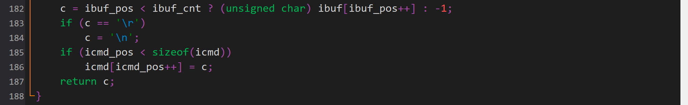</div>  

➤编译命令里`export CFLAGS="-D__stdin=stdin"`不能少，f30ap的libc库只有stdin符号。  
vi对我来说是个新奇玩意，还在探索。  
